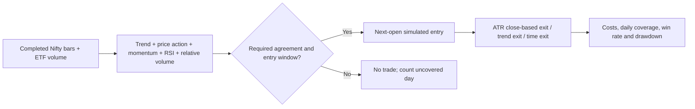

# Nifty daily confluence research

## Objective and result

Target: at least one qualifying trade on **every** full session, higher win
rate, lower drawdown and positive cost-adjusted expectancy. This is distinct
from averaging one trade per day. No candidate passed the combined requirements.

Same Nifty spot sample as the prior study: 29 September 2025–28 September 2026,
245 full weekday sessions, 18,375 bars. Research only; no order route.

## Five inputs

1. **Trend:** EMA 10 above EMA 30 for longs; below for shorts. An established
   trend can qualify; a fresh crossover is not required.
2. **Price action:** separately tested previous-bar high/low breakout,
   directional continuation, or EMA-10 pullback followed by a previous-bar break.
3. **Volume:** contemporaneous NIFTYBEES 5-minute volume divided by the median
   volume for the same clock slot over the preceding 20 available sessions
   (minimum 10). Thresholds 1.0 and 1.2. ETF volume is a proxy, not Nifty
   futures, options or aggregate constituent volume.
4. **Momentum:** three-bar price change positive for longs, negative for shorts.
5. **Oscillator:** RSI(14) between 50/55 and 75 for longs; between 25 and
   50/45 for shorts. The two threshold settings were fixed before testing.

Strict entries require all five. Flexible entries require trend and price
action plus any two of volume/momentum/RSI. Thus flexible entries may lack
volume confirmation; they must not be represented as strict five-way confluence.

## Execution and risk assumptions

Signal evaluated at completed close, fill at next 5-minute open. Entry window
09:30–14:45. One position at a time, initially maximum three trades daily,
10-minute re-entry cooldown. No forced clock-based entry.

Risk exits differ from the original crossover-only strategy: initial distance
1.5 ATR(14), target 1R or 1.5R, evaluated on **completed closes** with next-open
execution; also exit on opposite EMA trend, 60-minute maximum holding period,
or at 15:20. These are not resting stop/limit orders: intra-bar excursions,
gaps, and next-open execution can exceed the indicated ATR risk distance.
Both long and short trades are simulated in index points, not real contracts.

## Search and chronology

48 configurations: 3 price-action types x 2 volume thresholds x 2 RSI
thresholds x 2 agreement thresholds x 2 target multiples. First 147 sessions
for training, next 49 for validation, last 49 excluded from selecting
configurations. The recent data had already been used for earlier strategy
comparisons, so this is not a pristine untouched test or independent validation.

Development gates: every day traded, PF >=1.2 in both slices, positive P&L,
higher win rate and lower drawdown than baseline. **Zero passed.** Twenty-four
configurations satisfied daily coverage in both development slices; none
was profitable in both. The fallback is ranked by development coverage and
minimum PF and is not a recommendation. Selection saved before reporting
holdout results. No holdout-driven parameter reselection was performed.

Two later diagnostics were explicitly exploratory: retain only the first
daily trade of the frozen flexible setup, and evaluate the highest-ranked
strict all-five candidate from the saved development ranking. Neither is
promoted as an independently validated strategy.

## Results: 5 points all-in assumed friction per roundtrip

| Metric | Original crossover | First trade only, 4/5 | Strict 5/5 |
|---|---:|---:|---:|
| Trades | 532 | 245 | 679 |
| Sessions traded | 214/245 | 245/245 | 244/245 |
| Zero-trade sessions | 31 | 0 | 1 |
| Average trades/day | 2.17 | 1.00 | 2.77 |
| Win rate | 37.78% | 50.20% | 48.31% |
| Net index points | 346.00 | -1349.65 | -2828.85 |
| Profit factor | 1.026 | 0.759 | 0.780 |
| Maximum bar-close DD, points | 1076.05 | 1742.95 | 3160.05 |

First-trade configuration: EMA-10 pullback, volume ratio threshold 1.0,
RSI 50/50, 4-of-5 agreement, 1R target. It produced exactly one trade in
every historical full session, but was slightly negative even before costs
(-124.65 points). Historical 100% coverage cannot guarantee future coverage.

Strict configuration: directional candle with higher/lower close and close
in upper/lower half of its range, volume ratio >=1.0, 3-bar momentum,
RSI 55–75 long / 25–45 short, EMA trend, 1R target. Its gross profit was
566.15 points but costs on 679 trades were 3395 points, eliminating the edge.

Recent 49-session checks at 5-point friction: first-trade version made
-285.75 points, 48.98% wins, 449.55-point DD; strict version made -797.45
points, 43.17% wins, 837.25-point DD. Both lost money. At 10-point friction,
full-period losses deepen to -2574.65 and -6223.85 points respectively.

## Data and verification

NIFTYBEES is a Nifty 50-tracking ETF, per its
[issuer](https://mf.nipponindiaim.com/FundsAndPerformance/Pages/NipponIndia-ETF-Nifty-50-BeES.aspx).
All 18,375 analysis bars had contemporaneous ETF volume and a valid historical
relative-volume denominator. No forward/backward fill. Two duplicate ETF
timestamps had revised OHLC but exactly identical volume; the revisions are
saved in volume_conflicts.csv. Only their agreed volume is used; ETF prices
do not determine Nifty fills or returns. Conflicting volume would stop the run.

Ledger checks reconcile every trade's entry/exit price, same-day closure,
5-point friction and signal timing. First-trade daily cap and strict-five
signal evidence are checked explicitly. All excluded sessions remain
documented by the original study; coverage applies to full weekday sessions.
Drawdown is marked at candle closes, not every tick. Costs are sensitivity
assumptions, not contract-accurate brokerage/statutory charges or option decay.

## Reproduce

Use Python with pandas, numpy, openalgo, vectorbt, fyers-apiv3, matplotlib,
plotly and tqdm. Existing cached Nifty data is intentionally reused.

```
python fetch_volume.py
python research.py
python diagnostics.py
python render_report.py
```



The workflow demonstrates historical frequency, not a profitable deployable
strategy. Increasing indicator count or requiring daily trades did not resolve
negative expectancy. No live runner, broker setting, order or dashboard changed.
