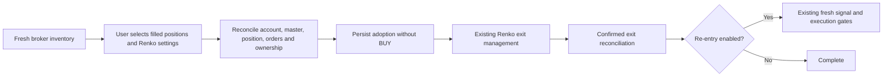

# Existing FYERS positions under Renko

For step-by-step controls and unavailable-state explanations, see the [user functional guide](user-functional-guide.md) or its [browser version](user-functional-guide.html).

Refresh the broker inventory in the Renko strategy view. Select already filled,
long MARGIN options on the chosen underlying, then use **Apply Renko · start LIVE
management**. The button applies the visible settings to each selected position.
It never submits an initial BUY. Each manager has a separate durable journal,
quota, signal state and ownership claim. The adopted position counts as the first
trade; subsequent entries use the configured lots and remaining trade quota.
Re-entry is an explicit option, off by default.

The existing Renko runner manages EMA, opposite confirmed signal, configured
hard boundaries, optional trailing and session square-off. Its existing fresh
signal rules govern later entries. Each manager shows broker average, quantity,
gross unrealized and realized P&L, and saved adoption/order evidence. Historical
entry time, fees and pre-adoption tick exposure are not fabricated. The original
adopted lifecycle is not retrospectively classified as a quick-loss trade; its
true exposure age is unavailable. Subsequent runner entries retain normal
journal and sideways-range behavior.

Pending/partial-entry orders, partial-lot positions, shorts, other products,
unmapped options, another strategy's claim and outstanding protective orders
block adoption. Symbol, quantity, average, product, account and current master
are checked again before ownership is saved. Broker order statuses are displayed
separately from positions. Batch managers initialize before any monitoring loops
start; initialization failure preserves stopped ownership for review.

A restart leaves every adopted manager stopped, preserving exposure and pending
intent. **Reconcile / resume** verifies broker ownership before resuming. An
owned pending order resumes its original reconciliation rather than resubmitting.
External quantity/average/side/product changes or unavailable broker evidence
pause management and preserve the claim. A fresh confirmation of external full
closure releases the claim without inventing an exit fill or starting re-entry.
Changed, ambiguous exposure requires manual reconciliation. **Pause monitoring**
stops monitoring and preserves ownership; it does not request a square-off.

Volume uses actual FYERS host-candle volume on a separate lower chart scale and
shares the exact candle timestamps. Missing volume is a whitespace gap, with an
unavailable readout; real zero remains zero. Forming volume is a broker snapshot,
not a value inferred from LTP ticks. Synthetic display volume remains explicitly
host volume rather than fabricated per-brick volume.

Verification: 14 fake-broker adoption tests cover ownership, no initial order,
exit quantity, re-entry setting, pending remainder, changed broker evidence,
multiple positions, restart, partial exit recovery, batch failure and master
mismatch. Served browser verification uses actual read-only FYERS inventory; no
live adoption/order mutation is executed during development.
